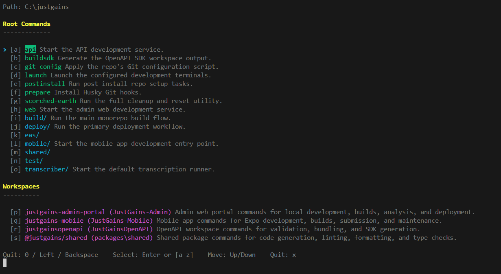

# JustDoIt


JustDoIt is a fast Bun CLI for browsing and running `package.json` scripts across a repo.

It gives you:

- root commands first
- workspace commands below a divider
- alphabet hotkeys
- nested `:` script menus
- optional descriptions from `package.doit.json`



## Install

```bash
bunx @justgains/doit
```

For local development:

```bash
git clone <repo>
cd justdoit
bun run ./src/index.ts --help
```

## Usage

Run in the repo you want to inspect:

```bash
bunx @justgains/doit
```

Point it at a specific folder:

```bash
bunx @justgains/doit --root ./apps
```

Scan deeper than the default 3 directories:

```bash
bunx @justgains/doit --depth 5
```

Initialize `package.doit.json` files:

```bash
bunx @justgains/doit --init
```

## How It Works

JustDoIt scans for `package.json` files, skips common generated folders like `node_modules` and `.git`, and builds a menu from each package's scripts.

Scripts with `:` become nested menus with no depth limit. For example:

```text
build:ios:dev
```

becomes:

```text
build -> ios -> dev
```

If a `package.doit.json` file exists next to a package, JustDoIt shows package and script descriptions in the menu.

## Controls

- `[a-z]` or `Enter`: select
- `Up` / `Down`: move
- `0`, `Left`, `Backspace`: back
- `x`: quit

## package.doit.json

JustDoIt can read extra metadata from a file named `package.doit.json` next to `package.json`.

Example:

```json
{
  "description": "Workspace commands for local development and deployment.",
  "instructions": "Fill in short user-facing descriptions.",
  "scripts": {
    "build": {
      "description": "Create the production build."
    },
    "build:ios:dev": {
      "description": "Build the iOS development app."
    }
  }
}
```

Running `bunx @justgains/doit --init` creates or refreshes these files and prints a short prompt you can give to an agent to fill in the descriptions.

## License

[MIT](./LICENSE)
